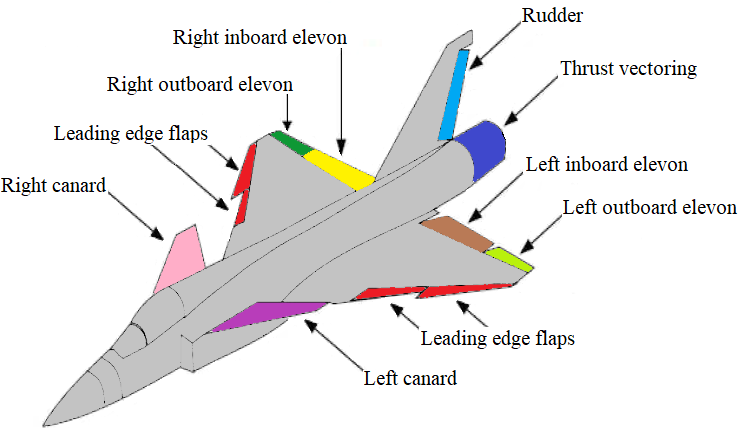
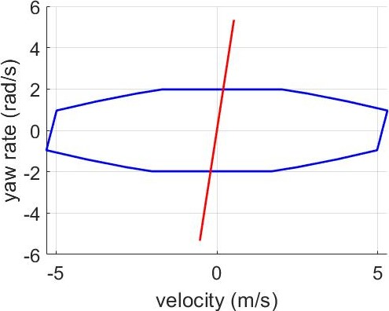
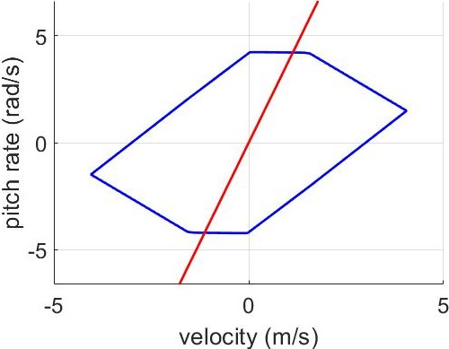
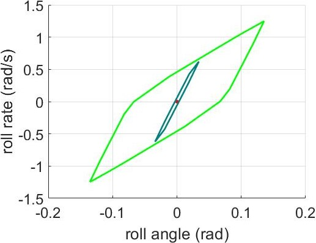
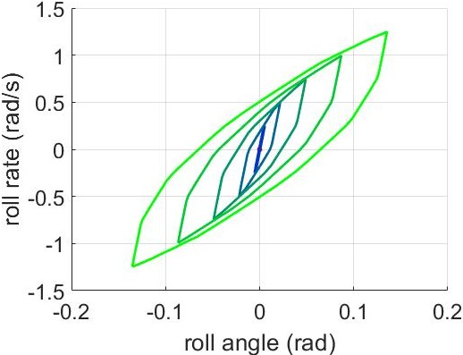
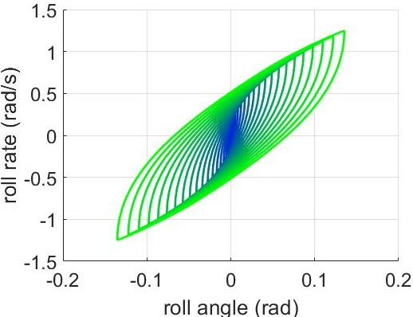
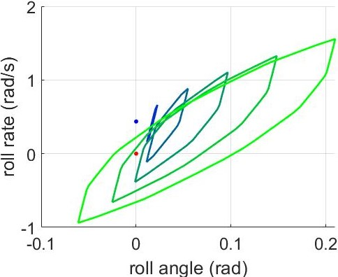
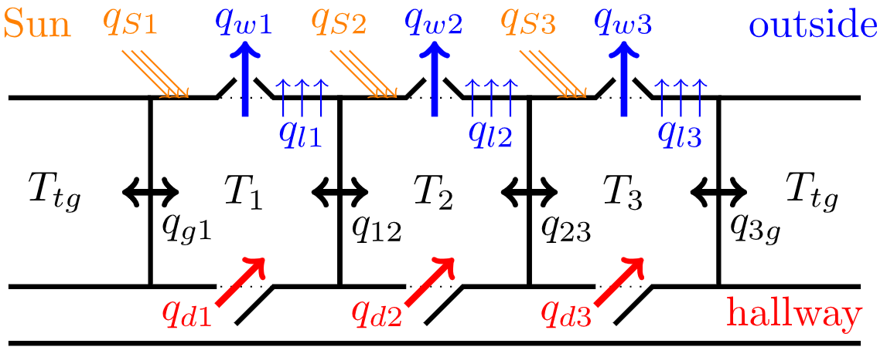
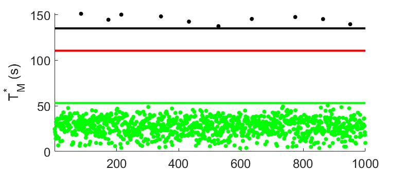

# Resilience of Linear Systems


This project is based on the paper ["Resilience of Linear Systems to Partial Loss of Control Authority"](https://doi.org/10.1016/j.automatica.2023.110985) by Jean-Baptiste Bouvier and Melkior Ornik, also available on [ArXiv](https://arxiv.org/abs/2209.08034). This repository contains all the MATLAB code necessary to reproduce the simulations shown in the paper.


## Overview

This project studies the resilience of linear systems to a partial loss of control authority over their actuators. 


This work focuses on quantifying the resilience of linear systems of nominal dynamics
$$\dot{x}(t) = Ax(t) + \bar{B} \bar{u}(t), \qquad x(0) = x_0 \in \mathbb{R}^n, \qquad \bar{u}(t) \in \bar{\mathcal{U}},$$
where $\bar{B} \in \mathbb{R}^{n \times (m+p)}$ is a constant matrix. After a *loss of control authority* over $p$ of the initial $m+p$ actuators of the system, we split control matrix $\bar{B}$ into two submatrices $B \in \mathbb{R}^{n \times m}$ and $C \in \mathbb{R}^{n \times p}$ representing respectively the controlled and uncontrolled actuators. Similarly, the input signal $\bar{u}$ and its constraint set $\bar{\mathcal{U}}$ are split between the admissible control signal $u$ belonging to compact set $\mathcal{U}$, and the uncontrolled and possibly undesirable input signal $w$ taking values in compact set $\mathcal{W}$. Then, the dynamics of the malfunctioning system can be written as
$$\dot{x}(t) = Ax(t) + Bu(t) + Cw(t), \qquad x(0) = x_0 \in \mathbb{R}^n, \qquad u(t) \in \mathcal{U}, \quad w(t) \in \mathcal{W}.$$
A target $x_g \in \mathbb{R}^n$ is *resiliently reachable* if for all undesirable input $w$ there exists a control input $u$ driving the state of the malfunctioning system from $x_0$ to $x_g$ in a finite time.
The nominal system is *resilient* to this partial loss of control authority if any target is resiliently reachable.
**We derive resilience conditions for the nominal system.**

Because of the malfunction, the system might need excessively longer to reach the same target compared to the nominal dynamics. To quantify the maximal delay due to the partial loss of control authority we introduce the *nominal reach time*

$$T_N^*(x_0, x_g) := \underset{\bar{u}(t) \\, \in \\, \bar{\mathcal{U}} }{\inf} \left\\{ T \geq 0 : x_g = e^{AT}\left( x_0 + \int_0^T e^{-At}\bar{B} \bar{u}(t) dt \right) \right\\},$$

and the *malfunctioning reach time*

$$T_M^*(x_0, x_g) := \underset{w(t) \\, \in \\, \mathcal{W} }{\sup} \left\\{ \underset{u(t) \\, \in \\, \mathcal{U} }{\inf} \left\\{ T \geq 0 : x_g = e^{AT}\left( x_0 + \int_0^T e^{-At}\big(Bu(t) + Cw(t)\big) dt\right) \right\\} \right\\}.$$

The *quantitative resilience* of this system is then defined as

$$r_q := \underset{x_0 \\, \in \\, \mathbb{R}^n, \\ x_g \\, \in \\, \mathbb{R}^n}{\inf} \frac{T_N^* (x_0, x_g)}{T_M^* (x_0, x_g)}.$$

On the contrary to the simpler [driftless case](https://github.com/Jean-BaptisteBouvier/Quantitative-Resilience), there are no geometrical solutions because the time-optimal inputs $\bar{u}^\ast$, $u^\ast$ and $w^\ast$ are bang-bang and not constant. Since exact analytical solutions are impossible, **we establish analytical bounds on both reach times and on the quantitative resilience.**


## Resilient reachability of the ADMIRE figther jet model

We study the resilient reachability of the [ADMIRE](https://github.com/Jean-BaptisteBouvier/ADMIRE) fighter jet model pictured below.

<p align="center">
     
</p>
<p align="center">
  ADMIRE jet model with colored actuators, image modified from <a href="https://doi.org/10.1016/j.automatica.2023.110985">this paper</a>.
</p>

The linearized dynamics at Mach 0.3 and altitude 2000 m are not resilient to the loss of control authority over either thrust vectoring actuators since $C\mathcal{W} \nsubseteq B\mathcal{U}$ as shown below. 

<p align="center">
   &nbsp; &nbsp; &nbsp; &nbsp;  
</p>
<p align="center">
  2D projections of sets $B\mathcal{U}$ (blue) and $C\mathcal{W}$ (red) for the loss of control over the yaw thrust vectoring (left) and pitch thrust vectoring (right).
</p>

After the loss of control authority over the right outboard elevon, we recursively approximate the resiliently reachable set with zonotopes of varying precision shown below.

<p align="center">
   &nbsp; &nbsp; &nbsp; &nbsp;  &nbsp; &nbsp; &nbsp; &nbsp;  
</p>
<p align="center">
  2D projections of the approximate reachable sets $\tilde{\Omega}_1, ..., \tilde{\Omega}_N$ for $N = 2$ (left), $N = 5$ (middle) and $N = 20$ (right).
</p>

If the in-flight damage responsible for the loss of control over the elevon also caused an inital jerk to a roll rate $p(0) = 0.44\\, rad/s$, we can visualize when the jet can be stabilized.

<p align="center">
  
</p>
<p align="center">
  2D projections of the approximate reachable sets $\tilde{\Omega}_1, ..., \tilde{\Omega}_5$. Initial state $x_0$ is the blue dot, while the goal state $x_g$ is the red dot.
</p>


## Resilience of a temperature control system

We study a room temperature control system, whose objective is to set $T_1$, $T_2$ and $T_3$ all equal to the target temperature $T_{tg}$. The system regulates heat transfers by controlling a central heater ($q_h$), central AC ($q_{AC}$) and the doors ($q_d$), windows ($q_w$) and blinds ($q_S$) of each rooms as illustrated below.

<p align="center">
  
</p>
<p align="center">
  Scheme of the rooms and heat transfers. The central heater ($q_h$) and central AC ($q_{AC}$) are not shown for clarity.
</p>

If a worker is manually overiding the control system by opening and/or closing the door and window of room 1, we can compute how much longer would the rooms need to reach their target temperature. Using our analytical bounds we can also bound this numerical solution as shown below.

<p align="center">
  
</p>
<p align="center">
  Upper bounds (black) and lower bounds (green) on the malfunctioning reach time $T_M^\ast(x_0)$ (red).
</p>


## File Structure

- The ADMIRE simulation is run with `amire_reachability.m` and requires the [CORA](https://tumcps.github.io/CORA/) toolbox available on MATLAB to compute the zonotopes.
- The temperature simulation is run with `temperature.m`.
- The functions `time_optimal_Eaton.m` and `time_optimal_Sakawa.m` compute the minimal reachability times for linear systems. They are used in the code `temperature.m`.


## Citation
```
@article{bouvier2023resilience,  
  title = {Resilience of Linear Systems to Partial Loss of Control Authority},   
  author = {Jean-Baptiste Bouvier and Melkior Ornik},    
  journal = {Automatica},    
  year = {2023},   
  volume = {152},
  pages = {110985},
  doi = {10.1016/j.automatica.2023.110985}
}
```


## Contributors

- [Jean-Baptiste Bouvier](https://jean-baptistebouvier.github.io/)
- [Melkior Ornik](https://mornik.web.illinois.edu/)


